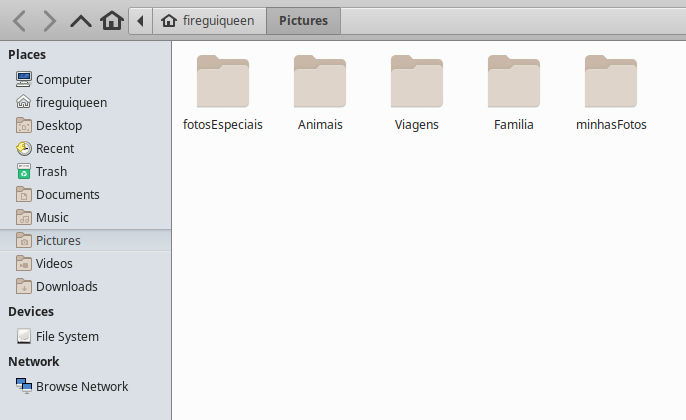
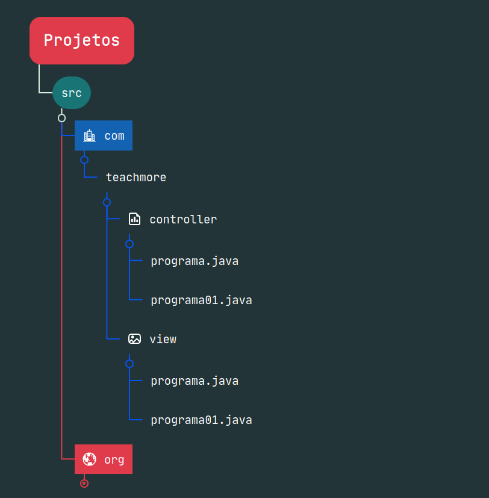

> A partir daqui, as próximas aulas ficaram contidas no diretório `src`. 

# Packages (pacotes)
Uma classe em Java é um arquivo que guarda instruções sobre como realizar/construir algo. 
No Java, existem classes que já vêm prontas, nos ajudando a adicionar novos recursos sem precisar criar tudo do zero. Essas milhares de classes ficam contidas em diversos __pacotes__. 
Um exemplo disso é a classe `Scanner` que fica contida no pacote `util`. Usamos  esta classe para
receber informações do usuário via terminal.

Um projeto simples pode ser composto por uma quantidade enorme de classes, cada uma desempenhando um papel 
específico no programa. Por exemplo, temos classes para tipos de dados, representação de texto, números, datas, 
conexão com bancos de dados, entre outras funcionalidades. Imagina todas essas classes existindo juntas em um 
único nível de documento? E as classes que foram desenvolvidas por nós para criar o programa? 
__Como ficaria a organização desse nosso diretório, hein?!__
> Resumindamente: _Os pacotes são subdiretórios contidos no diretório src. Eles são utilizados para organizar nosso programa e também armazenam as classes usadas no desenvolvimento do programa._

 

### Analogia-01
Pode-se fazer uma analogia com um curso de matemática, onde o mesmo é organizado por seções. 
Por exemplo, teremos a primeira seção chamada 'Aritmética'. Pelo nome, já é de se esperar que os vídeos 
estejam relacionados a soma, subtração, divisão e assim por diante. 
Já a segunda seção chama-se 'Álgebra', é de se esperar vídeos relacionados a equações, 
fatoração e outros temas similares. 
> _Podemos imaginar que as seções são os pacotes, e as aulas desta seção são as classes._

 

### Analogia-02
Suponha que você goste de tirar muitas fotos e, ao mesmo tempo, valorize a organização. 
Para salvar suas fotos, você as deixa em seu PC. O diretório (pasta) que contém suas fotos poderia ser organizado 
da seguinte maneira: 

> As pastas 'fotosEspeciais', 'Animais', 'Viagens'.. São pacotes. E as fotos contidas nesses pacotes, são as classes.

 

________________

# Pacotes em prática

## Convenções
Para criar pacotes, segue-se uma convenção, ou seja, um método padronizado globalmente na forma como os organizamos.
Uma forma simples de se entender uma convenção seria pensar na analogia-02. 
A pasta "pictures" segue uma convenção,  indicando o armazenamento de fotos. Do mesmo modo, o diretório "família" segue outra convenção, sugerindo que armazena 
fotos familiares. Independentemente de quem seja o usuário, a pasta "família" deixa claro o conteúdo armazenado na pasta em questão.

Podemos concluir que, embora o Java use o termo "pacote", esse conceito já existe há muito tempo e é aplicado em diversos 
contextos. A diferença é que, no Java, os pacotes não apenas _organizam_ um projeto, mas também são usados para armazenar
diferentes funcionalidades do programa. 
 
 

## Exemplos
Imagine que você trabalhe para uma empresa chamada TeachMore. A TeachMore está desenvolvendo dois projetos: 
um site comercial e um site institucional sem fins lucrativos.

Para organizar esses projetos, começamos com um diretório denominado `src (source)`. 
__O src será responsável por armazenar todos os pacotes que serão criados mais adiante.__

- A url do site comercial será: __teachmore.com__ 
> O “com” no nome de domínio .com indica um site “comercial”. Isso pode abranger sites de negócios, sites que desejam ganhar dinheiro online , sites pessoais, blogs, portfólios e etc.

- A url do site institucional será: __teachmore.org__
> O nome `org` significa "organização". Um domínio '.org' foi projetado, no início, para ser usado em sites de organizações não-comerciais (sem fins lucrativos).

 

O projeto comercial será um site dedicado a conectar professores de diversas áreas com alunos que assinam planos. 
Para um professor dar aula nesse site, é necessário passar por diversas etapas de avaliação para garantir a capacidade 
de lecionar. Além disso, este projeto também oferecerá remuneração a professores renomados que ministram aulas no site.

O projeto institucional será um site sem fins lucrativos, mantido pela comunidade, onde qualquer pessoa pode criar 
sua própria sala de aula virtual e começar a ensinar. Destinado a pessoas que não desejam ou não podem arcar com os custos 
relacionados à educação. Além disso, para os professores, o site se torna uma excelente plataforma para aprimorar suas 
habilidades de ensino e, naturalmente, um espaço para educadores que desejam contribuir de forma gratuita.

Para organizar esses projetos no diretório da empresa, vamos criar dois novos pacotes dentro de __src__. 
O primeiro pacote, denominado `com`, abrigará o projeto comercial, enquanto o segundo pacote, `org`, 
conterá o projeto institucional.

O pacote 'com' é designado para conter os projetos comerciais da empresa. Portanto, por motivos óbvios, nosso projeto 
comercial 'teachmore' será colocado dentro deste pacote.

Talvez tenha ficado um pouco estranho, pois o nome do nosso pacote `com` se tornou `com.teachmore`.
Na verdade, este ponto final, significa que estamos acessando o pacote `teachmore`. E isto sugere que temos dois pacotes:
- __com__
- __techmore__

Agora vamos adicionar pacotes que representam funcionalidades específicas do projeto. No nosso caso, isso pode incluir 
pacotes como controller, view, model, util e outros. Contudo, para o exemplo em questão, o projeto comercial terá apenas 
dois pacotes: view e controller. Esses pacotes têm a finalidade de organizar e separar as diferentes partes do projeto, 
o que facilita a administração e a manutenção do código-fonte.

- __View:__
O "view" é o pacote que contém classes responsáveis pela interface com a qual o usuário interage. 
É como a janela pela qual você vê e interage com um programa. Ele exibe as informações e os dados de maneira que o usuário 
possa compreender e interagir de forma fácil e amigável. É a camada que cuida de como as coisas são apresentadas na tela, garantindo que a experiência do usuário seja clara e intuitiva.

- __Controller:__
O "controller"  é o pacote que possui classes que gerenciam e controlam a lógica por trás das interações do usuário com um 
aplicativo ou sistema. Imagine o "controller" como um direcionador de tráfego, ele recebe as ações do usuário, 
processa essas ações e decide o que deve acontecer em seguida. 

Por fim, o nosso repostório é organizado da seguinte forma:

 

## Utilidade
A utilidade dos pacotes já está evidente, mas podemos reforçar com o mesmo exemplo. Imagine um novo membro, coreano, ingressando na PowerSoft na equipe de desenvolvimento. Seu foco é trabalhar na interface do site. Como nosso projeto está altamente organizado, em questão de segundos, ele pode localizar a classe responsável pelas interfaces. Isso ilustra o valor dos pacotes na facilitação da localização e gestão de diferentes partes do código, o que é fundamental para novos integrantes entenderem e colaborarem eficientemente.

 

______________________

# Import
O `import` é uma 